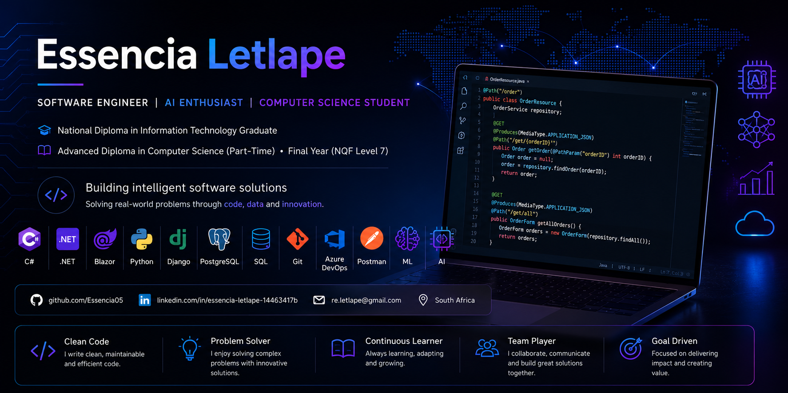

  

<h1 align="center">Hi 👋, I'm Essencia Letlape</h1>

<h3 align="center">
Software Engineer | AI Enthusiast | Computer Science Student
</h3>

Building software that solves real-world problems through continuous learning, collaboration, and innovation.

---

## 👩🏽‍💻 About Me

I'm an Information Technology graduate currently completing my **Advanced Diploma in Computer Science (Part-Time)** at **Tshwane University of Technology**.

I enjoy building scalable software solutions using **C#, .NET, Blazor, Python, and Django**, while continuously expanding my knowledge in **Artificial Intelligence**, **Machine Learning**, **Cloud Computing**, and **Modern Software Engineering**.

I enjoy solving problems, learning new technologies, and contributing to projects that create real business value.

---

## 🎓 Education

**Advanced Diploma in Computer Science (Part-Time)** *(NQF Level 7)*

Tshwane University of Technology

*Final Year • Expected Completion: December 2026*

---

**National Diploma in Information Technology (Software Development)**

Tshwane University of Technology

---

## 🚀 Career Interests

- Software Engineering
- Backend Development
- Artificial Intelligence
- Machine Learning
- Cloud Computing
- Digital Transformation
- Data Analytics
- FinTech

---

## 🛠️ Technical Skills

### Languages

- C#
- Python
- JavaScript
- SQL

### Frameworks

- .NET
- Blazor
- Django
- Django REST Framework

### Databases

- PostgreSQL
- SQL Server
- SQLite

### Tools

- Git
- GitHub
- Azure DevOps
- Visual Studio
- VS Code
- Postman
- Linux (Ubuntu)

### AI & Emerging Technologies

- GitHub Copilot
- ChatGPT
- Machine Learning Fundamentals
- Prompt Engineering

---

## 🌱 Currently Learning

- ASP.NET Core MVC
- Entity Framework Core
- Clean Architecture
- Azure AI
- OpenAI API
- Semantic Kernel
- Retrieval-Augmented Generation (RAG)
- Model Context Protocol (MCP)
- Docker

---

## 🚀 Featured Projects

### 🛒 Django Marketplace

A full-stack online marketplace built using Django where users can register, manage products, browse categories, and communicate securely.

**Tech Stack**

Python • Django • SQLite • HTML • CSS • Bootstrap

---

### 🏥 NovaCare Health Management System

Cloud-based healthcare platform developed using Agile principles featuring an AI-powered patient triage assistant.

**Role**

- Scrum Master
- Software Tester
- Backend Development
- Database Design

---

### 📍 Campus GPS System

University campus navigation system developed as an Agile team project.

**Role**

- Scrum Master
- Software Tester
- Backend Development
- User Stories
- ERD Design
- Test Cases

---

### 🔐 User Management REST API

REST API built with Django REST Framework implementing authentication and CRUD functionality.

---

## 📈 GitHub Goals (2026)

- Build 10 professional portfolio projects
- Master ASP.NET Core MVC
- Learn Azure Cloud
- Learn AI Engineering with .NET
- Contribute to Open Source
- Earn Microsoft Certifications

---

## 📫 Connect With Me

📧 **Email**

re.letlape@gmail.com

💼 **LinkedIn**

www.linkedin.com/in/essencia-letlape-14463417b

💻 **GitHub**

github.com/Essencia05

---

⭐ *"Continuous learning is the foundation of great software engineering."*
